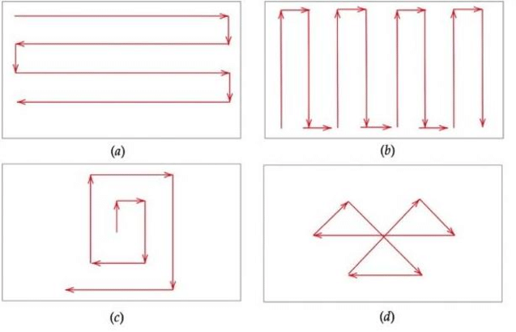

# UAV-Simulation
Hello World  
Using java and processing to simulate the path of the UAV

## File Structure
```
├─src
   ├─java
   │  ├─com
   │  │  ├─uav
   ├─Processing
```
## Tasks
- Have a map behind the UAV screen
- Possibly connect to the web and take a google location
- Instruction 1 : Click Take-off Area
- Display the latitude and longitude as you're moving the mouse
- Latitude signifies up and down the globe 
- Longitude goes left and right
- Get two lats and longitudes (Start and end point) 
- Travel to the endpoint then start the spiral pattern search 
## General Ideas
### Mapping system
- User clicks for lat and long coordinates  
- Background map  
- Possibly using google maps? (GPS)  
   - Maybe screenshots
   - Possibly Google API
      - Works in HTML and Javascript
      - Could HTML, Javascript, and Processing be used simultaneously?
### Drone flight patterns
- Spiral pattern  

### Drone movement
- Making fluid movement rather than teleporting  
### Customizing number of drones
- Making swarms to search an area  
- Delegate search zones to each drone  
- 1 to 4 drones  
- Changes flight patterns  

## To-Do List
- [ ] Smooth UAV movement(1 - 2 days)  
- [ ] Making multiple flight patterns (1 - 2 days)  
- [ ] Brainstorm flight paths for multiple drones at once (1 day)
- [ ] Avoiding rivers, trees, and houses (2 or 3 days)
- [ ] Figuring out the google maps API (1 - 2 days) 
- [ ] Applying the google maps API and adding zooming (2 days)  